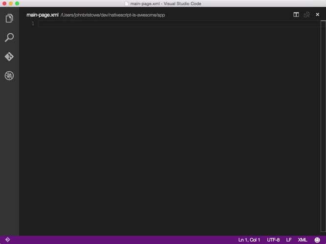

## NativeScript XML Snippets for Visual Studio Code ##



This JSON file contains snippets for all NativeScript UI components and some frequently used attributes.

All UI components are prefixed with ```ns```. Attributes do not have a prefix.

###UI Components

#### Layouts
- Absolute Layout - ```nsabsolute```
- Dock Layout - ```nsdock```
- Grid Layout - ```nsgrid```
- Stack Layout - ```nsstack```
- Wrap Layout - ```nswrap```

### Widgets
- Page - ```nspage```
- Action Bar - ```nsactionbar```
- Label - ```nslabel```
- Text Field - ```nstextfield```
- Secure Text Field (for passwords) - ```nspassword```
- Text View - ```nstextview```
- Image - ```nsimg```
- Border - ```nsborder```
- Button - ```nsbtn```
- Search Bar - ```nssearchbar```
- Switch - ```nsswitch```
- Slider - ```nsslider```
- Progress - ```nsprogress```
- Activity Indicator - ```nsloading```
- Date Picker - ```nsdate```
- Time Picker - ```nstime```
- List Picker - ```nslistpicker```
- Segmented Bar - ```nssegmentedbar```
- Tab View - ```nstabview```
- List View - ```nslistview```
- Web View - ```nswebview```

###Attributes
- cssClass - ```css```
- text - ```text```
- icon - ```icon```
- tap - ```tap```
- textWrap - ```wrap```
- horizontalAlignment - ```halign```
- verticalAlignment - ```valign```
- visibility - ```visibility```
- stretch - ```stretch```
- keyboardType - ```kbtype```
- colSpan - ```colspan```
- rowSpan - ```rowspan```
- row - ```row```
- col - ```col```
- width - ```width```
- height - ```height```

## How to use? ##

1. Navigate to the following folder.

   For Windows:
   ```bash
   %APPDATA%\Code\User\snippets
   ```

   For Linux/Mac:
   ```bash
   path/to/Code/User/snippets
   ```

2. Replace the ```xml.json``` file with this one or in case you already have other XML snippets,
append the contents of my file to yours.
